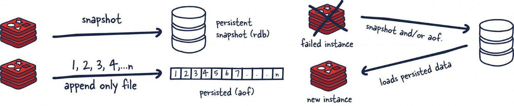

# Модели постоянного хранения данных в Redis

Если в Redis планируется размещать какие-либо данные в расчёте на их надёжное постоянное хранение, важно понимать то,
как именно это организовано в Redis. Существует множество ситуаций, когда потеря данных, хранящихся в Redis — это не
такая уж и катастрофа. Например — использование Redis в роли кеша, или в ситуациях, когда в Redis хранятся данные некоей
аналитической системы реального времени.

В других случаях разработчикам нужны некие гарантии относительно постоянного хранения данных и возможности их
восстановления.

Redis — быстрое хранилище, а все гарантии относительно целостности данных второстепенны в сравнении со скоростью. Это,
вероятно, спорная тема, но, на самом деле, так оно и есть.



## Постоянное хранение данных не используется

Если нужно — постоянное хранение данных можно отключить. Это — конфигурация, при использовании которой Redis работает
быстрее всего, но при этом не гарантируется надёжное хранение данных.

## RDB-файлы

Постоянное хранение данных в файлах RDB подразумевает создание снепшотов, содержащих данные, актуальные на определённые
моменты времени. Снепшоты создаются с заданными временными интервалами.

Главный минус этого механизма заключается в том, что данные, поступившие в хранилище между моментами создания снепшотов,
будут, при сбое Redis, утеряны. Кроме того, этот механизм хранения данных полагается на создание форка главного
процесса. При работе с большими наборами данных это может привести к кратковременным задержкам в обработке запросов. Но,
при этом, RDB-файлы загружаются в память гораздо быстрее, чем AOF.

## AOF

Механизм постоянного хранения данных, основанный на AOF, осуществляет журналирование каждой операции записи, запрос на
выполнение которой получает сервер. Эти операции будут воспроизведены при запуске сервера, что приведёт к воссозданию
исходного набора данных.

Такой подход к постоянному хранению данных гораздо надёжнее RDB. Ведь речь идёт не о снимках состояния хранилища, а о
файлах, рассчитанных только на присоединение к ним данных. Когда происходят операции, их буферизуют в журнале, но они не
оказываются сразу после этого размещёнными в постоянном хранилище. В журнале содержатся реальные команды, которые, если
нужно восстановить данные, запускают в том порядке, в котором они выполнялись.

Затем, когда это возможно, журнал сбрасывают на диск с помощью fsync (то, когда именно запускается этот процесс,
поддаётся настройке). После этого данные оказываются в постоянном хранилище. Минус этого подхода в том, что такой формат
хранения данных не является компактным, он требует больше места на диске, чем RDB-файлы.

Вызов fsync() переносит («сбрасывает») все модифицированные данные из памяти (то есть — модифицированные страницы
файлового буфера), имеющие отношение к файлу, представленному файловым дескриптором fd, на дисковое устройство (или на
другое устройство для постоянного хранения информации). В результате вся изменённая информация может быть восстановлена
даже после серьёзного сбоя или перезагрузки системы.

По разным причинам изменения, которые вносят в открытый файл, сначала попадают в кеш, а вызов fsync() гарантирует то,
что они будут физически сохранены на диск, то есть — позже их можно будет с диска прочитать.

## Почему бы не использовать и RDB, и AOF?

Можно скомбинировать AOF и RDB в одном и том же экземпляре Redis. Если надёжность хранения данных в обмен на некоторое
снижение скорости вас устраивает — можно так и поступить. Полагаю, что это — приемлемый способ использования Redis. Но
при этом, если система будет перезагружена, помните о том, что для восстановления данных Redis будет использовать AOF,
так как в этом хранилище находится более полная версия данных.

## 🛠️ Как это настроить в redis.conf

Чтобы включить оба механизма одновременно, в конфигурационном файле Redis должны быть активны обе секции:

```
Ini, TOML
# 1. Включаем RDB (сохранять, если изменилось X ключей за Y секунд)
save 900 1      # Если изменился 1 ключ за 15 минут
save 300 10     # Если изменилось 10 ключей за 5 минут
save 60 10000   # Если изменилось 10000 ключей за 1 минуту
dbfilename dump.rdb

# 2. Включаем AOF
appendonly yes
appendfilename "appendonly.aof"

# Настройка сброса AOF на диск (оптимально: раз в секунду)
appendfsync everysec
```

## 🔄 Как они взаимодействуют между собой?

1. При обычной работе (Запись данных)
   Когда Java-приложение или другой клиент пишет данные:
    * Команда сразу пишется в оперативную память Redis.
    * Раз в секунду (everysec) команда дописывается в конец файла appendonly.aof.
    * Раз в несколько минут (по правилам save) Redis делает фоновый fork(), берет снимок памяти и перезаписывает файл
      dump.rdb.

2. При старте/перезапуске сервера (Восстановление)
   > ❗ Важное правило: Если включены оба режима, при перезапуске Redis всегда игнорирует RDB и загружает данные из AOF.

Почему? Потому что в AOF журнал пишется непрерывно, и там гарантированно находится более полная и свежая версия вашей
базы данных. RDB в этот момент просто лежит на диске как резервный бэкап.

## 🚀 Современный подход: AOF с RDB-преамбулой (По умолчанию)

Начиная с версии Redis 4.0, появился гибридный режим, который включен по умолчанию (aof-use-rdb-preamble yes). Он
полностью решает проблему долгого чтения AOF-файла при старте.

### Как работает гибридный AOF:
Когда файл appendonly.aof разрастается слишком сильно, Redis запускает автоматическую оптимизацию — AOF Rewrite (команда
BGREWRITEAOF).

1. Redis делает fork() и берет текущий снимок памяти.
2. Он записывает этот снимок в начало файла AOF в бинарном формате RDB.
3. Все новые команды, которые прилетели во время этой записи, дописываются в конец файла в обычном текстовом формате
Redis-команд.

**Результат**: Файл appendonly.aof внутри выглядит как [Бинарный RDB блок] + [Текстовые команды за последние пару минут].
При перезапуске сервера бинарная часть «взлетает» в память мгновенно, а текстовый хвост быстро докатывается.

### ⚠️ О чем нужно помнить (Ограничения)
Нагрузка на диск (I/O): Оба механизма пишут на диск. Если у вас интенсивная запись, убедитесь, что используются быстрые
NVMe/SSD диски, иначе Redis начнет тормозить (так как fsync для AOF будет блокировать потоки).

Запас места на диске (X2): В моменты, когда Redis делает RDB-снимок или переписывает AOF, он создает временный файл на
диске и только потом заменяет им старый. На диске должно быть свободно как минимум столько же места, сколько весит ваша
база, иначе процесс упадет с ошибкой Out of disk space.
