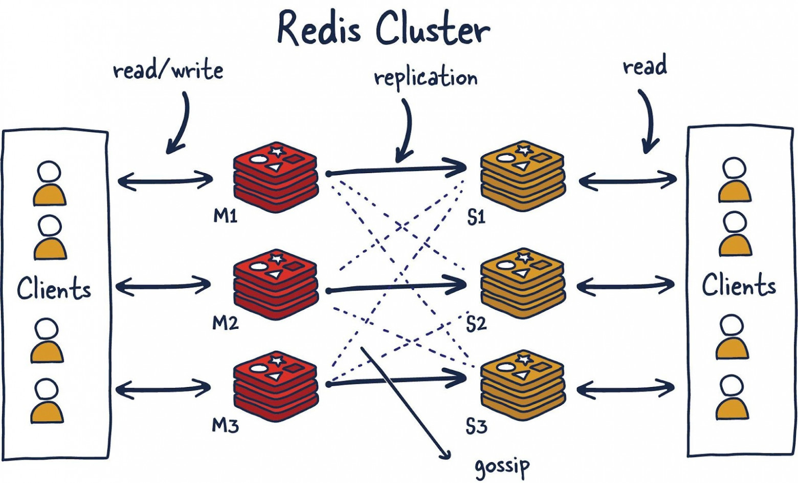

# Redis Cluster

> Redis Cluster НЕ использует Sentinel

> ваш кэш или данные исчисляются сотнями гигабайт или терабайтами и не влезают на один сервер — вам нужен Redis Cluster.




Redis Cluster, это будет значить, что мы решили распределить хранимые нами данные по множеству машин. Это называют
шардингом. В результате каждый экземпляр Redis, входящий в состав кластера, считается хранилищем шарда, или фрагмента,
всех данных.

Такой подход вызывает к жизни новую проблему. Если отправить в кластер данные — как узнать о том, какой именно экземпляр
Redis (шард) хранит эти данные? Есть несколько способов это сделать. Redis Cluster использует алгоритмический шардинг.

Для того чтобы найти шард для заданного ключа, мы хешируем ключ, а результат делим по модулю на количество шардов.
Затем, используя детерминистическую хеш-функцию (благодаря этому конкретный ключ всегда будет соответствовать одному и
тому же шарду), мы, когда нужно будет прочитать соответствующие данные, сможем узнать о том, где именно они хранятся.

Что произойдёт, если через некоторое время в систему будет добавлен новый шард? А произойдёт то, что называют
решардингом.

Исходя из предположения о том, что ключ foo был назначен шарду 0, он, после решардинга, может быть назначен шарду 5. Но
перемещение данных ради того, чтобы их размещение соответствовало бы новой конфигурации шардов, окажется медленной и
нереалистичной задачей в том случае, если мы хотим, чтобы операции по увеличению хранилища выполнялись бы быстро. Такое
перемещение данных, кроме того, окажет негативное влияние на доступность Redis Cluster.

В рамках Redis Cluster создан механизм, направленный на решение этой проблемы. Это — так называемые «хеш-слоты», в
которые и отправляют данные. Имеется около 16 тысяч таких слотов. Это даёт нам адекватный способ распределения данных по
кластеру, а при добавлении новых шардов нужно просто переместить в системе хеш-слоты. Поступая так, нам нужно лишь
перемещать хеш-слоты из шарда в шард и упростить процесс добавления новых ведущих экземпляров Redis в кластер.

Сделать это можно без простоев системы и с минимальным воздействием на её производительность. Рассмотрим пример.

* Узел M1 содержит хеш-слоты с 0 по 8191.
* Узел M2 содержит хеш-слоты с 8192 по 16383.

Назначая хеш-слот ключу foo, мы вычисляем детерминистический хеш от ключа (foo) и делим по модулю на количество
хеш-слотов (16383). В результате данные, соответствующие этому ключу, попадают на узел M2. Теперь, предположим, мы
добавляем в систему новый узел — M3. Новое соответствие узлов и хеш-слотов будет таким:

* Узел M1 содержит хеш-слоты с 0 по 5460.
* Узел M2 содержит хеш-слоты с 5461 по 10922.
* Узел M3 содержит хеш-слоты с 10923 по 16383.

Все ключи, которые попали в хеш-слоты узла M1, теперь принадлежащие узлу M2, понадобилось бы перенести. Но соответствие
отдельных ключей и хеш-слотов сохраняется, так как ключи уже распределены по хеш-слотам. Таким образом данный механизм
решает проблему решардинга при использовании алгоритмического шардинга.

## Протокол Gossip

Redis Cluster использует протокол Gossip для определения общего состояния кластера. На вышеприведённой иллюстрации
имеется 3 ведущих (M) узла и 3 подчинённых (S) узла. Все эти узлы постоянно обмениваются друг с другом информацией для
того чтобы знать о том, какие шарды доступны и готовы обрабатывать запросы. Если достаточное количество шардов согласно
с тем, что узел M1 не отвечает на запросы, они могут решить повысить S1 — подчинённый узел узла M1, до уровня ведущего
узла, чтобы поддержать кластер в работоспособном состоянии. Количество узлов, необходимое для запуска подобной
процедуры, поддаётся настройке. Очень важно правильно выполнить подобную настройку. Если сделать что-то не так, можно
оказаться в ситуации, когда кластер окажется разделённым на части в том случае, если он не сможет разрешить
неоднозначную ситуацию, когда «за» и «против» голосует одинаковое количество систем. Этот феномен называют «split
brain» (разделение вычислительных мощностей). Поэтому, в качестве общего правила, важно, чтобы в кластере было бы
нечётное количество ведущих узлов, у каждого из которых имеется два подчинённых узла. Это послужит хорошей основой для
построения надёжной системы.

## JAVA

🗺️ Архитектура и Участники (Пример сети)
В Redis Cluster данные делятся на 16384 хэш-слота (hash slots). Минимальное количество мастеров для полноценного
кластера — 3 штуки. У каждого мастера должна быть как минимум одна реплика.

Предположим, у нас есть следующая топология:

* Master 1: 192.168.2.10:6379 (Хранит слоты 0 – 5460)
   * Replica 1: 192.168.2.11:6379
* Master 2: 192.168.2.20:6379 (Хранит слоты 5461 – 10922)
   * Replica 2: 192.168.2.21:6379
* Master 3: 192.168.2.30:6379 (Хранит слоты 10923 – 16383)
   * Replica 3: 192.168.2.31:6379

* Java Application: 192.168.2.100 (Драйвер Lettuce или Jedis).

### 🔄 Кто с кем взаимодействует?

1. Взаимодействие между узлами Redis (Gossip-протокол)
   Все 6 узлов кластера постоянно общаются друг с другом напрямую.
   * Порт кластера: Для этого используется основной порт + 10000. То есть узлы связываются по порту 16379.
   * Обертка (Gossip): Они обмениваются PING/PONG пакетами, передавая друг другу информацию вида: "Я живой, Мастер 2 живой, а
вот Реплика 3 что-то перестала отвечать". Если большинство мастеров признают какой-то узел упавшим, реплика этого узла
автоматически станет новым мастером.

2. Как с этим работает Java-приложение?
>   ⚠️ Главное отличие от Sentinel: Java-приложение в случае Redis Cluster коннектится напрямую ко всем мастерам. Кластер
   не скрыт за единым прокси-сервером.

1. Старт приложения (Инициализация): В конфигурации Java (Spring Boot) достаточно указать адрес хотя бы одного любого узла
кластера (например, ```192.168.2.10:6379```).

2. Загрузка карты слотов: При первом подключении Java-клиент отправляет команду ```CLUSTER SLOTS```. В ответ он получает полную
карту сети: какой IP-адрес за какие диапазоны хэш-слотов отвечает. Клиент кэширует эту карту у себя в памяти.

3. Выполнение запроса (Прямой расчет): * Приложению нужно выполнить команду ```SET user:100 "Ivan"```.
   * Java-драйвер берет ключ ```user:100```, пропускает его через алгоритм балансировки ```CRC16(key) % 16384``` и вычисляет номер
хэш-слота. Допустим, получился слот **7150**.
   * Драйвер смотрит в свою карту в памяти и видит, что за слот 7150 отвечает **Master 2** (```192.168.2.20:6379```).
   * Java-приложение отправляет запрос напрямую на IP ```192.168.2.20```.

> Что такое MOVED редирект? Если карта слотов в Java устарела (например, произошел сбой и слот переехал), узел Redis
вернет ошибку -MOVED 7150 192.168.2.20:6379. Java-клиент поймет, что топология изменилась, обновит карту слотов в памяти
и автоматически перенаправит запрос на правильный IP.

## ➕ Что будет, если добавить новый Master в кластер?
Допустим, нам перестало хватать памяти, и мы решили добавить **Master 4** (```192.168.2.40:6379```) с его репликой ```192.168.2.41:
6379```.

Процесс происходит в несколько этапов без остановки системы (Zero Downtime):

[Старый Кластер: 3 Мастера] ──> [Добавление пустого Master 4] ──> [Решалдинг (Перенос слотов)]
──> [Обновление карты слотов в Java]

1. **Подключение узла (Handshake)**
   Администратор выполняет команду ```redis-cli --cluster add-node 192.168.2.40:6379 192.168.2.10:6379```.
   Новый узел подключается к кластеру по Gossip-протоколу. Все узнают о его существовании, но изначально у **Master 4** 0
   хэш-слотов. Он пустой и не принимает данные.

2. **Перераспределение слотов (Решардинг / Resharding)**
   Чтобы новый мастер начал работать, ему нужно отдать часть слотов. Запускается утилита решардинга. Кластер решает
   выделить новому мастеру ровно 4096 слотов (16384 / 4), забрав их поровну у трех старых мастеров.

   * Как переезжают данные: Перенос происходит поклиентно и онлайн. Например, переносится слот 5460 с Master 1 на Master 4.
   * Состояния MIGRATING и IMPORTING: На время переноса конкретного слота Master 1 помечает его как MIGRATING, а Master 4 как
IMPORTING.

3. Как в этот момент ведет себя Java-приложение?
   Если Java пытается прочитать ключ, находящийся в процессе миграции:

   1. Она обращается к старому Master 1.
   2. Если ключ уже переехал, Master 1 отвечает специальной ошибкой -ASK 5460 192.168.2.40:6379.
   3. Java-клиент отправляет команду ASKING, а затем сам запрос на новый Master 4 и получает данные.
   4. Это временное перенаправление (оно не инвалидирует основную карту слотов в памяти Java, пока весь слот окончательно не
переедет).

4. Завершение процесса
   Как только все 4096 слотов переехали на ```192.168.2.40:6379```, миграция завершается. При следующем запросе любого ключа
   из этих слотов узел вернет полноценный ```-MOVED 192.168.2.40:6379```. Java-драйвер один раз обновит свою карту слотов в
   памяти и далее начнет слать все запросы для этих слотов напрямую новому **Master 4**. Нагрузка на старые мастера падает,
   кластер расширен!