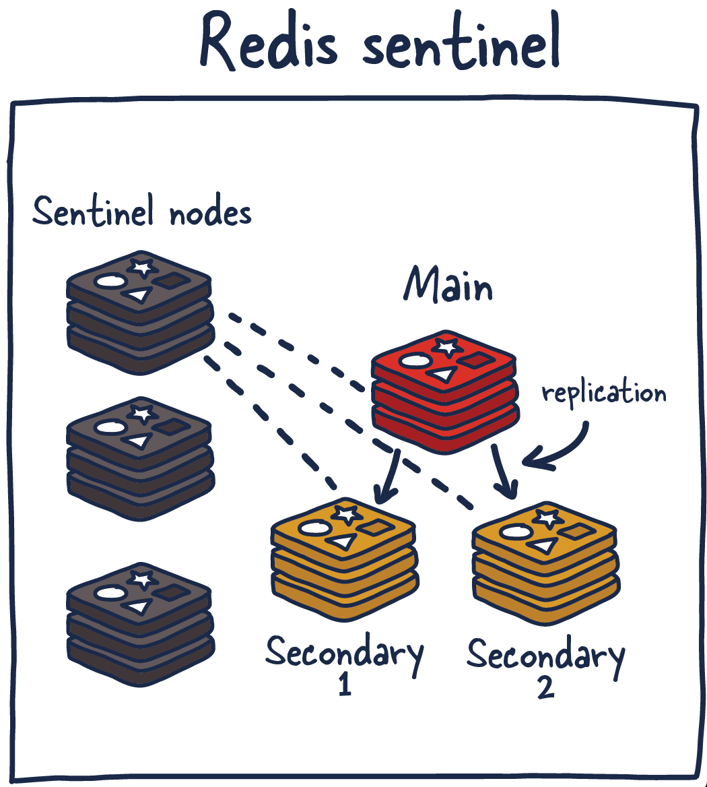

# Redis Sentinel

> Redis Cluster НЕ использует Sentinel
 

> Если у вас база данных Redis относительно небольшая (до 30–50 ГБ) и вам просто нужно, чтобы она не падала, если сгорит сервер — ваш выбор Redis Sentinel.


— это сервис, обеспечивающий создание распределённых систем. И, как и в случае со всеми распределёнными системами, у
Sentinel имеются и сильные, и слабые стороны. В основе Sentinel лежит кластер Sentinel-процессов, работающих совместно.
Они координируют состояние системы, реализуя конфигурацию высокой доступности Redis. Sentinel — это сервис, защищающий
хранилище Redis от сбоев. Поэтому логично то, чтобы этот сервис не имел бы единой точки отказа.

Сервис Sentinel решает несколько задач. Во-первых — он обеспечивает работоспособность и доступность текущих ведущих и
подчинённых узлов. Благодаря этому текущий Sentinel-процесс (вместе с другими подобными процессами) может отреагировать
на ситуацию, когда теряется связь с ведущими и/или подчинёнными узлами. Во-вторых — он играет определённую роль в деле
обнаружения сервисов. Похожим образом в других системах работают Zookeeper и Consul. То есть — когда новый клиент
пытается что-то записать в хранилище Redis, Sentinel сообщит клиенту о том, какой экземпляр Redis в этот момент является
ведущим.

Получается, что узлы Sentinel постоянно мониторят доступность экземпляров Redis и отправляют сведения о них клиентам,
что позволяет клиентам предпринимать определённые действия в тех случаях, когда хранилище даёт сбой.


(

Вот какие функции выполняют узлы Sentinel:

* Мониторинг. Обеспечение того, что ведущие и подчинённые узлы работают так, как ожидается.
* Отправка уведомлений администраторам. Система отправляет администраторам уведомления о происшествиях в экземплярах
  Redis.
* Управление восстановлением системы после отказа. Узлы Sentinel могут запустить процесс восстановления системы после
  сбоя
  в том случае, если ведущий экземпляр Redis недоступен и достаточное количество (кворум) узлов согласно с тем, что это
  так.
* Управление конфигурацией. Узлы Sentinel, кроме того, играют роль системы, позволяющей обнаруживать текущий ведущий
  экземпляр Redis.

Использование Redis Sentinel для решения вышеописанных задач позволяет обнаруживать сбои Redis. Процедура обнаружения
сбоя включает в себя получение согласия нескольких узлов Sentinel с тем, что текущий ведущий экземпляр Redis недоступен.
Процесс получения такого согласия называют кворумом (quorum). Это позволяет повысить надёжность системы, защититься от
ситуаций, когда один из процессов ведёт себя неправильно и не может подключиться к ведущему узлу Redis.

**Кворум** — это минимальное число голосов, которое нужно получить распределённой системе для того, чтобы ей было бы
позволено выполнять определённые операции, наподобие восстановления после сбоя. Это число поддаётся настройке, но оно
должно отражать количество узлов в рассматриваемой распределённой системе. **Размеры большинства распределённых систем
равняются трём или пяти узлам**, в них, соответственно, кворум равен двум или трём голосам. Нечётные количества узлов
предпочтительны в случаях, когда системе необходимо разрешать неоднозначности.

У Redis Sentinel есть и недостатки. Поэтому мы рассмотрим несколько рекомендаций и практических советов, касающихся
этого сервиса.

Redis Sentinel можно развернуть несколькими способами. Честно говоря, чтобы дать какие-то адекватные рекомендации, мне
нужны подробности о той системе, в составе которой планируется использовать Redis Sentinel. В качестве общего правила я
посоветовал бы запускать узел Sentinel вместе с каждым из серверов приложения (если это возможно). Это позволит не
обращать внимания на различия, связанные с сетевыми подключениями узлов Sentinel и клиентов, которые используют Redis.

Sentinel можно запустить и на тех же машинах, на которых работают экземпляры Redis, или даже в виде независимых узлов,
но это, в различных формах, усложняет ситуацию. Рекомендую применять как минимум три узла с кворумом, как минимум, из
двух. Вот простая таблица, в которой описано количество серверов в кластере, даны сведения о кворуме и о количестве
допустимых отказов.

| Количество серверов | Кворум | Количество допустимых отказов |
|---------------------|--------|-------------------------------|
| 1                   | 1      | 0                             |
| 2                   | 2      | 0                             |
| 3                   | 2      | 1                             |
| 4                   | 3      | 1                             |
| 5                   | 3      | 2                             |
| 6                   | 4      | 2                             |
| 7                   | 4      | 3                             |

Подобные показатели будут, от системы к системе, различаться, но общая идея остаётся подобной той, что выражена в
таблице.

Подумаем о том, что может пойти не так в системе, в которой используется Sentinel. Если такая система будет работать
достаточно долго — можно столкнуться со всеми этими проблемами.

* Что если узлы Sentinel выйдут из состава кворума?
* Что если сеть разделится и старый ведущий экземпляр Redis окажется в меньшей группе узлов Sentinel? Что произойдёт с
  данными, записанными в этот экземпляр Redis? (Подсказка: эти данные, после полного восстановления системы, будут
  утеряны.)
* Что произойдёт, если сетевые топологии узлов Sentinel и клиентских узлов (узлов приложения) окажутся несогласованными?

У нас нет гарантий устойчивости системы, особенно учитывая то, что операции по сохранению данных на диск (об этом —
ниже) выполняются асинхронно. Тут ещё имеется неприятная проблема, связанная с тем, когда именно клиенты узнают о
появлении новых ведущих узлов. Сколько команд записи данных уйдут в никуда, будучи отправленными в ситуации, когда новый
ведущий узел неизвестен? Разработчики Redis рекомендуют запрашивать сведения о новом ведущем узле при установлении новых
соединений. Это, что зависит от конфигурации системы, может приводить к серьёзным потерям данных.

Есть несколько способов уменьшить масштабы потерь данных в том случае, если принудить ведущий экземпляр Redis к
репликации операций записи на как минимум один подчинённый экземпляр. Помните о том, что репликация в Redis выполняется
асинхронно, и что у неё есть свои недостатки. Поэтому понадобится независимо отслеживать подтверждения получения данных,
а если не удастся получить подтверждение от хотя бы одного подчинённого узла, главный узел должен прекратить принимать
запросы на запись данных.

## 🗺️ Архитектура и Участники (Пример сети)

Для надежной работы Sentinel требуется минимум 3 узла Sentinel (чтобы собирать кворум и избегать проблемы Split-Brain).
Предположим, у нас есть следующая инфраструктура:

* Redis узлы:
    * 192.168.1.10:6379 — Мастер (Master) (принимает чтение и запись)
    * 192.168.1.11:6379 — Реплика 1 (Replica) (только чтение)
    * 192.168.1.12:6379 — Реплика 2 (Replica) (только чтение)

* Sentinel узлы (часто запускаются на тех же машинах, но на порту 26379):
    * 192.168.1.10:26379 — Sentinel 1
    * 192.168.1.11:26379 — Sentinel 2
    * 192.168.1.12:26379 — Sentinel 3

* Java Application:
    * 192.168.1.50 — Сервер с вашим Spring Boot / Java приложением.

## 🔄 Кто с кем взаимодействует?

1. Взаимодействие внутри Redis + Sentinel
    * Sentinel ↔ Redis Master (192.168.1.10:6379): Все три Sentinel-сервера постоянно (раз в секунду) отправляют команду
   PING мастеру, чтобы проверить, жив ли он. Также они запрашивают команду INFO, чтобы получить актуальный список
   подключенных к нему реплик.
    * Sentinel ↔ Redis Replicas: Получив список реплик от мастера, Sentinel-ы начинают мониторить и их (192.168.1.11 и
192.168.1.12), проверяя их статус.
    * Sentinel ↔ Sentinel: Sentinel-ы общаются между собой через специальный механизм Pub/Sub внутри самого Redis Мастера. Они
обмениваются информацией вида: "Привет, я Sentinel 1, я вижу мастера по адресу 192.168.1.10:6379, он работает". Так они
узнают о существовании друг друга.

2. Как с этим работает Java-приложение?
   > ⚠️ Главное заблуждение: Java-приложение НЕ отправляет запросы с данными (GET/SET) в Sentinel. Sentinel — это не
   прокси-сервер (как HAProxy или Redis Cluster). Через него не ходят ваши гигабайты кэша.

Алгоритм работы Java-приложения (например, через библиотеку Jedis или Lettuce):

1. Старт приложения: В конфигурации Java-приложения жестко прописываются только адреса Sentinel-ов и имя мастера (например,
mymaster).
    * Конфиг Java: sentinels = ["192.168.1.10:26379", "192.168.1.11:26379", "192.168.1.12:26379"], masterName = "mymaster"
2. Запрос адреса: При запуске Java-клиент подключается к любому живому Sentinel (например, к 192.168.1.11:26379) и
спрашивает: "Кто сейчас mymaster?" (команда SENTINEL get-master-addr-by-name mymaster).
3. Ответ от Sentinel: Sentinel отвечает: "Сейчас мастер — 192.168.1.10:6379".
4. Прямое соединение: Java-приложение создает стандартный пул соединений напрямую к Redis Master (192.168.1.10:6379) и
начинает писать/читать данные туда.
5. Подписка на изменения: Параллельно Java-клиент подписывается на Pub/Sub канал Sentinel-а (канал +switch-master), чтобы
мгновенно узнать, если мастер изменится.

## 💥 Что происходит при аварии (Failover)?
Допустим, сервер с мастером 192.168.1.10 полностью сгорает.

[Шаг 1] Мастер упал ──> [Шаг 2] Sentinel-ы голосуют (Кворум) ──> [Шаг 3] Выборы нового Мастера (например, 192.168.1.11)
│
[Шаг 5] Java пишет в новый Мастер <── [Шаг 4] Java получает уведомление ────┘

1. Обнаружение (Subjectively Down - sdown): Sentinel 2 перестал получать ответы на PING от мастера 192.168.1.10. Он считает
его мертвым субъективно.

2. Кворум (Objectively Down - odown): Sentinel 2 спрашивает у Sentinel 3 и Sentinel 1: "Вы видите мастера?". Если Sentinel
3 соглашается (набран кворум из 2 голосов), мастер признается объективно мертвым.

3. Выборы лидера и Failover: Sentinel-ы выбирают среди себя "главного" для проведения реорганизации. Этот выбранный
Sentinel отправляет команду реплике 192.168.1.11:6379 -> SLAVEOF NO ONE (сделать мастера из самого себя). А реплике
192.168.1.12 говорит переподключиться к новому мастеру.

4. Уведомление Java-приложения: По каналу +switch-master Sentinel-ы публикуют сообщение: "Внимание! Мастер теперь на
192.168.1.11:6379".

5. Переключение в Java: Драйвер в Java-приложении (Jedis/Lettuce) ловит это событие, закрывает старый пул соединений к
192.168.1.10 и автоматически открывает новый пул к 192.168.1.11:6379. Приложение продолжает работать без перезапуска.

## 📝 Пример конфигурации в Java (Spring Data Redis)
В коде это выглядит очень просто, так как драйвер всю внутреннюю кухню переключений берет на себя:

```java
@Configuration
public class RedisConfig {

    @Bean
    public RedisConnectionFactory redisConnectionFactory() {
        // Указываем имя мастера и список Sentinel-ов
        RedisSentinelConfiguration sentinelConfig = new RedisSentinelConfiguration()
                .master("mymaster")
                .sentinel("192.168.1.10", 26379)
                .sentinel("192.168.1.11", 26379)
                .sentinel("192.168.1.12", 26379);
        
        // Опционально: можно настроить чтение с реплик для снижения нагрузки на мастер
        // LettuceClientConfiguration clientConfig = LettuceClientConfiguration.builder()
        //        .readFrom(ReadFrom.REPLICA_PREFERRED).build();

        return new LettuceConnectionFactory(sentinelConfig);
    }

}
```

## Итог: К кому коннектится Java?
* Для получения топологии (при старте и сбоях): К Sentinel-ам (:26379).
* Для бизнес-логики (сохранение/чтение сессий, кэша): Напрямую к Redis-мастеру или репликам (:6379).


# как Sentinel решает, кого из реплик «повысить», и что происходит с данными.

## 🗳️ Шаг 1. Как Sentinel выбирает нового Мастера?
Когда старый мастер (например, 192.168.1.10) признан мертвым, Sentinel-ы начинают выбирать среди оставшихся реплик (192.168.1.11 и 192.168.1.12) нового лидера. Отбор идет по строгому алгоритму с 4 фильтрами:

1. Проверка связи (Disconnection time): Если какая-то реплика была долго отключена от старого мастера (Sentinel это видит) и её данные слишком сильно устарели, она сразу дисквалифицируется.
2. Приоритет реплики (replica-priority): В конфиге каждой реплики можно задать вес (число). Чем оно меньше, тем выше приоритет. Если у Replica 1 приоритет 10, а у Replica 2 — 100, выберут первую. Если приоритет равен 0, узел вообще никогда не станет мастером.
3. Смещение репликации (Replication Offset) — Ваш случай: Если приоритеты одинаковые, Sentinel смотрит на офсеты. Побеждает та реплика, у которой офсет больше. Больший офсет означает, что эта реплика успела получить от погибшего мастера больше данных перед его смертью и является наиболее «свежей».
4. ID процесса (Run ID): Если и офсеты совпали, Sentinel выбирает ту реплику, у которой чисто случайно оказался меньше ASCII-значение Run ID (уникальный хэш процесса Redis, генерируемый при старте). Просто чтобы выбрать хоть кого-то.

> Итог выбора: Sentinel выберет реплику с максимальным офсетом. Допустим, это Replica 1 (192.168.1.11).

## 🔄 Шаг 2. Что происходит со «отставшей» репликой?
Итак, Sentinel отправил команде 192.168.1.11 команду SLAVEOF NO ONE. Теперь она — Новый Мастер.

У нас осталась Replica 2 (192.168.1.12), у которой офсет был меньше (она отставала).

1. Sentinel отправляет ей команду переключиться на нового лидера: SLAVEOF 192.168.1.11 6379.
2. Так как у них разные Replication ID (новый мастер сгенерировал себе новый ID при повышении), Replica 2 понимает, что правитель сменился.
3. Происходит сверка: если отставание было небольшим и остатки логов сохранились в буфере (backlog) нового мастера, произойдет частичная синхронизация (PSYNC) — Replica 2 просто докачает то, чего ей не хватало. Если буфер затерт — произойдет полная синхронизация (SYNC) с перезаписью RDB-снапшота.

## ⚠️ Шаг 3. А что будет с данными, которые вообще никто не успел получить?
Самый болезненный вопрос: Мастер подтвердил Java-приложению, что записал данные, а через миллисекунду умер. Ни одна реплика этот офсет получить не успела.

По умолчанию репликация в Redis асинхронная. Если данные не ушли ни на одну реплику, они будут безвозвратно утеряны. Когда старый мастер (192.168.1.10) вернется в сеть, Sentinel переведет его в режим реплики (SLAVEOF 192.168.1.11), он сотрет свои уникальные «новые» данные и скачает базу нового мастера. Поизойдет так называемый split-brain эффект (частичная потеря данных).

Как от этого защититься? (Настройка Redis)
Если вам категорически нельзя терять данные из-за разности офсетов, в redis.conf Мастера нужно включить жесткие лимиты:
```
Ini, TOML
# Требовать, чтобы как минимум N реплик подтверждали получение данных
min-replicas-to-write 1

# Максимальная задержка (в секундах) от реплики, при которой мастер еще принимает запись
min-replicas-max-lag 10
```

Как это работает с Java:
Если Replica 1 и Replica 2 отстанут от Мастера сильнее, чем на 10 секунд (или обе упадут), Мастер перестанет принимать операции записи от вашего Java-приложения и начнет возвращать ошибку (error) NOREPLICAS.

Это гарантирует: если Java смогла записать данные в Мастер, значит как минимум одна реплика имеет актуальный офсет, и при аварии данные не пропадут.

