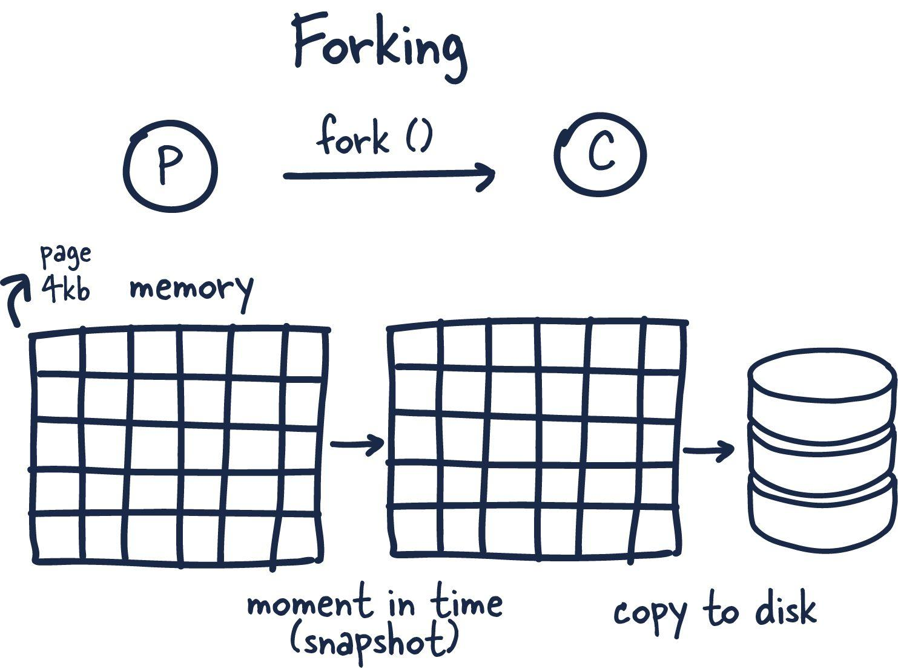

# Форк

— это когда операционная система, по команде, вызванной неким процессом, создаёт новый процесс, копируя родительский
процесс. В результате в нашем распоряжении оказывается новый ID процесса и ещё некоторые полезные сведения. При этом
только что созданный форк процесса (процесс-потомок) может взаимодействовать с процессом-родителем.

А вот теперь начинается самое интересное. Redis — это процесс, которому выделено огромное количество памяти. Как
скопировать такой процесс и не столкнуться с нехваткой памяти?

Когда создают форк процесса — процесс-родитель и процесс-потомок используют память совместно. Redis начинает процесс
создания снепшота в процессе-потомке. Это возможно благодаря технике совместного использования памяти, называемой
«копирование при записи». При этом во время создания форка память не выделяется, используются ссылки на уже выделенную
память. Если, во время сброса данных дочерним процессом на диск, ничего в памяти не менялось, новая память выделяться не
будет.

В том случае, если изменения были, происходит следующее. Ядро операционной системы отслеживает ссылки на каждую страницу
памяти. Если на некую страницу имеется больше одной ссылки — изменения записываются в новые страницы. Процесс-потомок
ничего не знает об изменениях, в его распоряжении имеется стабильный снимок памяти. В результате для создания форка
процесса используется лишь небольшой объём памяти. Мы можем быстро и эффективно создавать снепшоты, отражающие состояние
хранилища на некий момент времени, размеры которых могут достигать многих гигабайтов.

()

Давайте разберем детально, как работает форкинг, почему он не «взрывает» оперативную память и как его использует Redis.

## 🛠️ Базовый механизм: Как устроен fork()

Когда процесс (например, основной поток Redis) вызывает функцию fork(), операционная система мгновенно создает новый
процесс, который называют процессом-потомком (child process). Исходный процесс становится процессом-родителем (parent
process).

* Потомок получает свой уникальный идентификатор процесса (PID).
* Потомок является точной копией родителя на момент вызова: он наследует то же состояние памяти, открытые файлы, сетевые
  сокеты и даже точку в коде, на которой остановился родитель.

## 🧠 Магия оптимизации: Copy-on-Write (Копирование при записи)

Главный вопрос: Если у нас Redis занимает 32 ГБ в оперативной памяти, неужели при форке операционная система будет
дублировать все 32 ГБ, тратя на это кучу времени и требуя еще 32 ГБ свободной памяти?

Нет. Физического копирования памяти в этот момент не происходит благодаря механизму Copy-on-Write (CoW).

* При вызове fork(): Ядро Linux копирует только таблицу страниц памяти (индексы, указывающие, где что лежит), а не сами
  данные. И родитель, и потомок начинают одновременно смотреть на одни и те же физические участки в оперативной памяти.
* Маркировка страниц: Все эти страницы памяти помечаются операционной системой как read-only (только для чтения) для
  обоих процессов.
* Когда происходит запись (Защита данных): * Дочерний процесс (потомок) просто читает данные из памяти и последовательно
  сбрасывает их на диск в виде RDB-снапшота. Ему менять память не нужно.
    * Но в этот же момент реальные клиенты продолжают слать запросы в основной процесс Redis (родитель). Родитель
      пытается изменить значение какого-то ключа.
    * Операционная система видит попытку записи в read-only страницу, перехватывает её, копирует конкретно эту маленькую
      страницу памяти (обычно размером всего 4 КБ) в новое место, разрешает родителю внести изменения туда и обновляет
      указатель в таблице страниц родителя.

> Результат: Дочерний процесс работает со «слепком» памяти, который застыл ровно в миллисекунду вызова fork(). Он не
> замечает новых изменений и спокойно пишет их на диск. Дополнительная память выделяется только под те ключи, которые
> изменились за время сохранения.

## 💾 Зачем форкинг нужен в Redis?

Redis по своей сути — преимущественно однопоточное приложение (его основное event-loop ядро обрабатывает команды
последовательно).

Если бы Redis сохранял гигабайты данных на диск в основном потоке, вся база данных «замирала» бы на десятки секунд.
Форкинг решает эту проблему:

* Для RDB-снимков: Создается форк. Родоначальный поток продолжает моментально отвечать клиентам, а процесс-потомок в
  фоне пишет данные в файл dump.rdb и завершается.

* Для AOF-перезаписи (AOFRW): Когда файл журнала становится слишком большим, форк сканирует память и генерирует новый
  сжатый файл AOF (преамбулу).

## ⚠️ Подводные камни форкинга

Несмотря на гениальность механизма CoW, у форкинга в Redis есть две опасности, о которых важно знать администраторам баз
данных:

* Задержка (Fork latency): Хотя сами данные не копируются, копирование таблицы страниц при огромных размерах базы
  данных (например, более 60–100 ГБ) может занять у процессора ощутимое время (сотни миллисекунд). В этот момент
  основной поток Redis будет заблокирован, а у клиентов вырастет latency.
* Проблема Huge Pages (THP): В Linux есть функция Transparent Huge Pages, которая укрупняет страницы памяти с 4 КБ до 2
  МБ ради оптимизации. Для Redis это катастрофа: если при включенном THP клиент изменит хотя бы один мелкий ключ (строку
  в пару байт), операционная система скопирует по механизму CoW сразу 2 мегабайта памяти. Это приводит к лавинообразному
  расходу ОЗУ во время фонового сохранения. Поэтому Redis всегда требует отключать THP в системе.